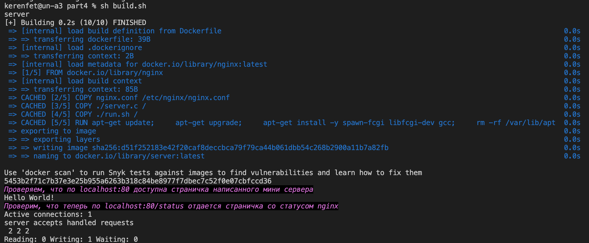

# Part 1. Готовый докер

- Шаг 1 — Взять официальный докер образ с nginx и выкачать его при помощи docker pull

```
docker pull nginx
```


- Шаг 2 - Проверить наличие докер образа через docker images

```
docker images
```


-  Шаг 3 - Запустить докер образ через docker run -d 

```
docker run  -d nginx
```


-  Шаг 4 - Проверить, что образ запустился через docker ps

```
docker ps
```


-  Шаг 5 - Посмотреть информацию о контейнере через docker inspect 

```
docker inspect nginx
```

Результат
```
[
    {
        "Id": "sha256:61395b4c586da2b9b3b7ca903ea6a448e6783dfdd7f768ff2c1a0f3360aaba99",
        "RepoTags": [
            "nginx:latest"
        ],
        "RepoDigests": [
            "nginx@sha256:32da30332506740a2f7c34d5dc70467b7f14ec67d912703568daff790ab3f755"
        ],
        "Parent": "",
        "Comment": "",
        "Created": "2023-09-20T16:43:59.968055126Z",
        "Container": "863fdcd387ea8acb8b74c9b28db01d3da0e154b1752e087c17ca1bf3dcb90d69",
        "ContainerConfig": {
            "Hostname": "863fdcd387ea",
            "Domainname": "",
            "User": "",
            "AttachStdin": false,
            "AttachStdout": false,
            "AttachStderr": false,
            "ExposedPorts": {
                "80/tcp": {}
            },
            "Tty": false,
            "OpenStdin": false,
            "StdinOnce": false,
            "Env": [
                "PATH=/usr/local/sbin:/usr/local/bin:/usr/sbin:/usr/bin:/sbin:/bin",
                "NGINX_VERSION=1.25.2",
                "NJS_VERSION=0.8.0",
                "PKG_RELEASE=1~bookworm"
            ],
            "Cmd": [
                "/bin/sh",
                "-c",
                "#(nop) ",
                "CMD [\"nginx\" \"-g\" \"daemon off;\"]"
            ],
            "Image": "sha256:3b2f458929e18623de347479de73236067715ac36681cf720ad29da0382df8fb",
            "Volumes": null,
            "WorkingDir": "",
            "Entrypoint": [
                "/docker-entrypoint.sh"
            ],
            "OnBuild": null,
            "Labels": {
                "maintainer": "NGINX Docker Maintainers <docker-maint@nginx.com>"
            },
            "StopSignal": "SIGQUIT"
        },
        "DockerVersion": "20.10.23",
        "Author": "",
        "Config": {
            "Hostname": "",
            "Domainname": "",
            "User": "",
            "AttachStdin": false,
            "AttachStdout": false,
            "AttachStderr": false,
            "ExposedPorts": {
                "80/tcp": {}
            },
            "Tty": false,
            "OpenStdin": false,
            "StdinOnce": false,
            "Env": [
                "PATH=/usr/local/sbin:/usr/local/bin:/usr/sbin:/usr/bin:/sbin:/bin",
                "NGINX_VERSION=1.25.2",
                "NJS_VERSION=0.8.0",
                "PKG_RELEASE=1~bookworm"
            ],
            "Cmd": [
                "nginx",
                "-g",
                "daemon off;"
            ],
            "Image": "sha256:3b2f458929e18623de347479de73236067715ac36681cf720ad29da0382df8fb",
            "Volumes": null,
            "WorkingDir": "",
            "Entrypoint": [
                "/docker-entrypoint.sh"
            ],
            "OnBuild": null,
            "Labels": {
                "maintainer": "NGINX Docker Maintainers <docker-maint@nginx.com>"
            },
            "StopSignal": "SIGQUIT"
        },
        "Architecture": "amd64",
        "Os": "linux",
        "Size": 186639942,
        "VirtualSize": 186639942,
        "GraphDriver": {
            "Data": {
                "LowerDir": "/var/lib/docker/overlay2/3e3c9dd77da9b5f1af90fe96d1ab36528f6412af2389dc405e1463015d1e7153/diff:/var/lib/docker/overlay2/052aaf69a8c38ae728bab6d977c33f4b335189ee84ffe701b6339d10ada61f08/diff:/var/lib/docker/overlay2/6298e3cc87785196dc45717d8fd38ee2483ad7f08b2c944369ce001ccab0bea4/diff:/var/lib/docker/overlay2/2f4c91c54dd425d96777c54b77dc747d87b8024b42073498f90ea2b4c3f73542/diff:/var/lib/docker/overlay2/71f386c2494ef69bbecc17c0771e83e6cacd1d4cd90f2a8e0d9d19009f5934fc/diff:/var/lib/docker/overlay2/61f59756d54a2073acfeccf27affb50010d7f53302b99fa4049ba096f52041a5/diff",
                "MergedDir": "/var/lib/docker/overlay2/6283589c00d5da3027b75364a586e116dab31594bd319095641a9c0ec3fa40a2/merged",
                "UpperDir": "/var/lib/docker/overlay2/6283589c00d5da3027b75364a586e116dab31594bd319095641a9c0ec3fa40a2/diff",
                "WorkDir": "/var/lib/docker/overlay2/6283589c00d5da3027b75364a586e116dab31594bd319095641a9c0ec3fa40a2/work"
            },
            "Name": "overlay2"
        },
        "RootFS": {
            "Type": "layers",
            "Layers": [
                "sha256:d310e774110ab038b30c6a5f7b7f7dd527dbe527854496bd30194b9ee6ea496e",
                "sha256:eb7e3384f0ab3a08dd0163ab66625d954e511e8fa112c09923e261418c8524cb",
                "sha256:1dc45c680d0f1615d45021e85028c5d2089468518ec44b7aeeb947cdf0b22364",
                "sha256:ea43d4f82a03877421d6bed1db76fd58f87555193a7921cefb22d6067d8963a7",
                "sha256:9c6261b5d19808f0feab896f5f65c0f6287aa8589f880d4af64414608e54c023",
                "sha256:a7e2a768c198ee94c3a3e8a1cc199a69510da1e39fd85beddc2d4f3200a21d1e",
                "sha256:d26d4f0eb474290793ba42d20b4880daa7c6ddf0379adeb1c121e04f2840712e"
            ]
        },
        "Metadata": {
            "LastTagTime": "0001-01-01T00:00:00Z"
        }
    }
]
```

```
docker ps -> container ID
```

```
docker inspect '63bfc88c5d58'
```
Результат: 

```
[
    {
        "Id": "63bfc88c5d58257ef83be87ee9f3689f1d93b000001c1a43fbd1d6ba75cd6d54",
        "Created": "2023-09-21T12:34:49.323535408Z",
        "Path": "/docker-entrypoint.sh",
        "Args": [
            "nginx",
            "-g",
            "daemon off;"
        ],
        "State": {
            "Status": "running",
            "Running": true,
            "Paused": false,
            "Restarting": false,
            "OOMKilled": false,
            "Dead": false,
            "Pid": 2071,
            "ExitCode": 0,
            "Error": "",
            "StartedAt": "2023-09-21T12:34:49.814453578Z",
            "FinishedAt": "0001-01-01T00:00:00Z"
        },
        "Image": "sha256:61395b4c586da2b9b3b7ca903ea6a448e6783dfdd7f768ff2c1a0f3360aaba99",
        "ResolvConfPath": "/var/lib/docker/containers/63bfc88c5d58257ef83be87ee9f3689f1d93b000001c1a43fbd1d6ba75cd6d54/resolv.conf",
        "HostnamePath": "/var/lib/docker/containers/63bfc88c5d58257ef83be87ee9f3689f1d93b000001c1a43fbd1d6ba75cd6d54/hostname",
        "HostsPath": "/var/lib/docker/containers/63bfc88c5d58257ef83be87ee9f3689f1d93b000001c1a43fbd1d6ba75cd6d54/hosts",
        "LogPath": "/var/lib/docker/containers/63bfc88c5d58257ef83be87ee9f3689f1d93b000001c1a43fbd1d6ba75cd6d54/63bfc88c5d58257ef83be87ee9f3689f1d93b000001c1a43fbd1d6ba75cd6d54-json.log",
        "Name": "/nice_mayer",
        "RestartCount": 0,
        "Driver": "overlay2",
        "Platform": "linux",
        "MountLabel": "",
        "ProcessLabel": "",
        "AppArmorProfile": "",
        "ExecIDs": null,
        "HostConfig": {
            "Binds": null,
            "ContainerIDFile": "",
            "LogConfig": {
                "Type": "json-file",
                "Config": {}
            },
            "NetworkMode": "default",
            "PortBindings": {},
            "RestartPolicy": {
                "Name": "no",
                "MaximumRetryCount": 0
            },
            "AutoRemove": false,
            "VolumeDriver": "",
            "VolumesFrom": null,
            "CapAdd": null,
            "CapDrop": null,
            "CgroupnsMode": "private",
            "Dns": [],
            "DnsOptions": [],
            "DnsSearch": [],
            "ExtraHosts": null,
            "GroupAdd": null,
            "IpcMode": "private",
            "Cgroup": "",
            "Links": null,
            "OomScoreAdj": 0,
            "PidMode": "",
            "Privileged": false,
            "PublishAllPorts": false,
            "ReadonlyRootfs": false,
            "SecurityOpt": null,
            "UTSMode": "",
            "UsernsMode": "",
            "ShmSize": 67108864,
            "Runtime": "runc",
            "ConsoleSize": [
                0,
                0
            ],
            "Isolation": "",
            "CpuShares": 0,
            "Memory": 0,
            "NanoCpus": 0,
            "CgroupParent": "",
            "BlkioWeight": 0,
            "BlkioWeightDevice": [],
            "BlkioDeviceReadBps": null,
            "BlkioDeviceWriteBps": null,
            "BlkioDeviceReadIOps": null,
            "BlkioDeviceWriteIOps": null,
            "CpuPeriod": 0,
            "CpuQuota": 0,
            "CpuRealtimePeriod": 0,
            "CpuRealtimeRuntime": 0,
            "CpusetCpus": "",
            "CpusetMems": "",
            "Devices": [],
            "DeviceCgroupRules": null,
            "DeviceRequests": null,
            "KernelMemory": 0,
            "KernelMemoryTCP": 0,
            "MemoryReservation": 0,
            "MemorySwap": 0,
            "MemorySwappiness": null,
            "OomKillDisable": null,
            "PidsLimit": null,
            "Ulimits": null,
            "CpuCount": 0,
            "CpuPercent": 0,
            "IOMaximumIOps": 0,
            "IOMaximumBandwidth": 0,
            "MaskedPaths": [
                "/proc/asound",
                "/proc/acpi",
                "/proc/kcore",
                "/proc/keys",
                "/proc/latency_stats",
                "/proc/timer_list",
                "/proc/timer_stats",
                "/proc/sched_debug",
                "/proc/scsi",
                "/sys/firmware"
            ],
            "ReadonlyPaths": [
                "/proc/bus",
                "/proc/fs",
                "/proc/irq",
                "/proc/sys",
                "/proc/sysrq-trigger"
            ]
        },
        "GraphDriver": {
            "Data": {
                "LowerDir": "/var/lib/docker/overlay2/c082609cb41c19d2559a03128b6a3d383c231dd70559c6a89765b5b8d1329ea5-init/diff:/var/lib/docker/overlay2/6283589c00d5da3027b75364a586e116dab31594bd319095641a9c0ec3fa40a2/diff:/var/lib/docker/overlay2/3e3c9dd77da9b5f1af90fe96d1ab36528f6412af2389dc405e1463015d1e7153/diff:/var/lib/docker/overlay2/052aaf69a8c38ae728bab6d977c33f4b335189ee84ffe701b6339d10ada61f08/diff:/var/lib/docker/overlay2/6298e3cc87785196dc45717d8fd38ee2483ad7f08b2c944369ce001ccab0bea4/diff:/var/lib/docker/overlay2/2f4c91c54dd425d96777c54b77dc747d87b8024b42073498f90ea2b4c3f73542/diff:/var/lib/docker/overlay2/71f386c2494ef69bbecc17c0771e83e6cacd1d4cd90f2a8e0d9d19009f5934fc/diff:/var/lib/docker/overlay2/61f59756d54a2073acfeccf27affb50010d7f53302b99fa4049ba096f52041a5/diff",
                "MergedDir": "/var/lib/docker/overlay2/c082609cb41c19d2559a03128b6a3d383c231dd70559c6a89765b5b8d1329ea5/merged",
                "UpperDir": "/var/lib/docker/overlay2/c082609cb41c19d2559a03128b6a3d383c231dd70559c6a89765b5b8d1329ea5/diff",
                "WorkDir": "/var/lib/docker/overlay2/c082609cb41c19d2559a03128b6a3d383c231dd70559c6a89765b5b8d1329ea5/work"
            },
            "Name": "overlay2"
        },
        "Mounts": [],
        "Config": {
            "Hostname": "63bfc88c5d58",
            "Domainname": "",
            "User": "",
            "AttachStdin": false,
            "AttachStdout": false,
            "AttachStderr": false,
            "ExposedPorts": {
                "80/tcp": {}
            },
            "Tty": false,
            "OpenStdin": false,
            "StdinOnce": false,
            "Env": [
                "PATH=/usr/local/sbin:/usr/local/bin:/usr/sbin:/usr/bin:/sbin:/bin",
                "NGINX_VERSION=1.25.2",
                "NJS_VERSION=0.8.0",
                "PKG_RELEASE=1~bookworm"
            ],
            "Cmd": [
                "nginx",
                "-g",
                "daemon off;"
            ],
            "Image": "nginx",
            "Volumes": null,
            "WorkingDir": "",
            "Entrypoint": [
                "/docker-entrypoint.sh"
            ],
            "OnBuild": null,
            "Labels": {
                "maintainer": "NGINX Docker Maintainers \u003cdocker-maint@nginx.com\u003e"
            },
            "StopSignal": "SIGQUIT"
        },
        "NetworkSettings": {
            "Bridge": "",
            "SandboxID": "50150da7eec080889acd065d1627d26832f9ccbc322df7a7ebd67108428b2d2d",
            "HairpinMode": false,
            "LinkLocalIPv6Address": "",
            "LinkLocalIPv6PrefixLen": 0,
            "Ports": {
                "80/tcp": null
            },
            "SandboxKey": "/var/run/docker/netns/50150da7eec0",
            "SecondaryIPAddresses": null,
            "SecondaryIPv6Addresses": null,
            "EndpointID": "31cb61cf3c49565bfdb82bbff35b19f8ff899ae061692979d47c85702af39319",
            "Gateway": "172.17.0.1",
            "GlobalIPv6Address": "",
            "GlobalIPv6PrefixLen": 0,
            "IPAddress": "172.17.0.2",
            "IPPrefixLen": 16,
            "IPv6Gateway": "",
            "MacAddress": "02:42:ac:11:00:02",
            "Networks": {
                "bridge": {
                    "IPAMConfig": null,
                    "Links": null,
                    "Aliases": null,
                    "NetworkID": "79b2887e2e0cecee16de1229cf7f7a19895652075b1639926b1e41f3b9c12e77",
                    "EndpointID": "31cb61cf3c49565bfdb82bbff35b19f8ff899ae061692979d47c85702af39319",
                    "Gateway": "172.17.0.1",
                    "IPAddress": "172.17.0.2",
                    "IPPrefixLen": 16,
                    "IPv6Gateway": "",
                    "GlobalIPv6Address": "",
                    "GlobalIPv6PrefixLen": 0,
                    "MacAddress": "02:42:ac:11:00:02",
                    "DriverOpts": null
                }
            }
        }
    }
]
```

-  Шаг 6 - По выводу команды определить и поместить в отчёт размер контейнера, список замапленных портов и ip контейнера

* "Size": 186639942
* "Ports": {"80/tcp": null}
* "IPAddress": 172.17.0.2

-  Шаг 7 - Остановить докер образ через docker stop [container_id|container_name] и проверить, что образ остановился через docker ps

```
docker stop [container id]
docker ps
```


-  Шаг 8 - Запустить докер с замапленными портами 80 и 443 на локальную машину через команду run

```
docker run -p 80:80 -p 443:443 -d nginx
```


-  Шаг 9 - Проверить, что в браузере по адресу localhost:80 доступна стартовая страница nginx

```
curl localhost:80
```


-  Шаг 10 - Перезапустить докер контейнер через docker restart [container_id|container_name]. Проверить любым способом, что контейнер запустился

```
docker restart container_name
docker ps
curl localhost:80
```


Cтартовая страница nginx по адресу localhost:80 


# Part 2. Операции с контейнером

-  Шаг 1 - Прочитать конфигурационный файл nginx.conf внутри докер контейнера через команду exec

```
docker exec agitated_curie cat /etc/nginx/nginx.conf
```


-  Шаг 2 - Создать на локальной машине файл nginx.conf

```
docker exec agitated_curie cat /etc/nginx/nginx.conf > nginx.conf
```


-  Шаг 3 - Настроить в нем по пути /status отдачу страницы статуса сервера nginx

Содержание файла nginx.conf

```
events {
    worker_connections  1024;
}

http {
    server {
        listen       80;
        listen  [::]:80;
        server_name  localhost;

        #access_log  /var/log/nginx/host.access.log  main;

        location / {
            root   /usr/share/nginx/html;
            index  index.html index.htm;
        }

        location /status {
            stub_status; 
            allow all;
        }
        
        error_page   500 502 503 504  /50x.html;
        location = /50x.html {
            root   /usr/share/nginx/html;
        }
    }
}=
```

-  Шаг 4 - Скопировать созданный файл nginx.conf внутрь докер образа через команду docker cp

```
docker cp ./nginx.conf agitated_curie:/etc/nginx/nginx.conf
```


-  Шаг 5 - Перезапустить nginx внутри докер образа через команду exec

Проверка правильности написания файла конфигурации
```
docker exec agitated_curie nginx -t 
```

Перезапуск nginx
```
docker exec agitated_curie nginx -s reload
```


-  Шаг 6 - Проверить, что по адресу localhost:80/status отдается страничка со статусом сервера nginx

```
curl localhost:80/status
```


-  Шаг 7 - Экспортировать контейнер в файл container.tar через команду export

```
docker export e6777b48e730 > container.tar
```


-  Шаг 8 - Остановить контейнер

```
docker stop e6777b48e730
```


-  Шаг 9 - Удалить образ через docker rmi [image_id|repository], не удаляя перед этим контейнеры

```
docker rmi -f [repository]
```
![docker rmi -f [repository]](images/part%202.9%20docker%20rmi%20-f%20%5Brepository%5D.png)

-  Шаг 10 - Удалить остановленный контейнер

```
docker rm [containet_id]
```
![docker rm [containet_id]](images/2.10%20container%20delete.png)

-  Шаг 11 - Импортировать контейнер обратно через команду import

```
docker import --change "ENTRYPOINT [\"/docker-entrypoint.sh\"]" \
--change "EXPOSE 80" \
--change "CMD [\"nginx\", \"-g\", \"daemon off;\"]" - myn:latest < container.tar
```


-  Шаг 12 - Запустить импортированный контейнер

```
docker run -d -p 80:80 -p 443:443 myn
```


-  Шаг 13 - Проверить, что по адресу localhost:80/status отдается страничка со статусом сервера nginx

```
curl localhost:80/status
```


# Part 3. Мини веб-сервер

- Шаг 1 - Написать мини сервер на C и FastCgi, который будет возвращать простейшую страничку с надписью Hello World!

```c
#include "fcgi_stdio.h"
#include <stdlib.h>

int main(void)
{
    while(FCGI_Accept() >= 0)
    {
        printf("Content-type: text/html\r\nStatus: 200 OK\r\n\r\nHello World!");
    }

    return 0;
}
```
Написать свой nginx.conf, который будет проксировать все запросы с 81 порта на 127.0.0.1:8080

```conf
user  nginx;
worker_processes  auto;

error_log /var/log/nginx/error.log notice;
pid /var/run/nginx.pid;

events {
    worker_connections  1024;
}

http {
    server {
        listen 81;
        location /status {
            stub_status; 
            allow all;
        }
        location / {
            fastcgi_pass 127.0.0.1:8080;
        }
    }
}
```


-  Шаг 2 - Запустить написанный мини сервер через spawn-fcgi на порту 8080

- Запустить докер контейнер на 81 порту

```
docker run -d -p 81:81 nginx:latest
docker ps
```


- Перекинем server.c в docker контейнер командой:

```
docker cp nginx.conf affectionate_khorana:/etc/nginx/nginx.conf
docker cp server.c affectionate_khorana:/
```

- Перейти в докер 

```
docker exec -it affectionate_khorana bash
```

- Установим необходимые библиотеки и компилятор gcc в docker container:

```
apt-get update
apt-get upgrade
apt-get install -y libfcgi-dev spawn-fcgi
apt-get install gcc
```

- Компилируем и запускаем сервер

```
gcc -o server server.c -lfcgi
spawn-fcgi -p 8080 ./server
nginx -s reload
```


-  Проверяем страницу http://localhost:81/


# Part 4. Свой докер

-  Написать свой докер образ, который:

1) собирает исходники мини сервера на FastCgi из Части 3

2) запускает его на 8080 порту

3) копирует внутрь образа написанный ./nginx/nginx.conf

4) запускает nginx.

```
FROM nginx
USER root
COPY nginx.conf /etc/nginx/nginx.conf
COPY ./server.c /
COPY ./run.sh /
RUN apt-get update; \
    apt-get upgrade; \
    apt-get install -y spawn-fcgi libfcgi-dev gcc; \
    rm -rf /var/lib/apt/lists/*
ENTRYPOINT ["sh", "./run.sh"]

```

- Собрать написанный докер образ через docker build при этом указав имя и тег

```
#!/bin/bash

docker rm -f server
docker build . -t server:latest -f Dockerfile
docker run -d -p 80:81 -v "$(pwd)/../nginx/nginx.conf:/etc/nginx/nginx.conf" --name server server:latest

sleep 1

printf "\e[0m\e[3;40;95m%s\e[0m\n" "Проверяем, что по localhost:80 доступна страничка написанного мини сервера"
curl localhost:80
printf "\n"
printf "\e[0m\e[3;40;95m%s\e[0m\n" "Проверим, что теперь по localhost:80/status отдается страничка со статусом nginx"
curl localhost:80/status
```

  

- Проверить через docker images, что все собралось корректно


- Запустить собранный докер образ с маппингом 81 порта на 80 на локальной машине и маппингом папки ./nginx внутрь контейнера по адресу, где лежат конфигурационные файлы nginx'а

Добавить в build.sh
```
docker run -d -p 80:81 -v "$(pwd)/../nginx/nginx.conf:/etc/nginx/nginx.conf" server:latest
```

- Проверить localhost:80/status отдается страничка со статусом nginx


# Part 5. Dockle

Dockle - это инструмент для сканирования Docker-образов с целью выявления уязвимостей и нарушений правил безопасности. Он позволяет проверить Docker-образы на соответствие рекомендациям и наличие известных уязвимостей в компонентах, входящих в образ.

- Установить Dockle 

```
brew install goodwithtech/r/dockle
```

- Просканировать образ из предыдущего задания через dockle [image_id|repository]

```
dockle [image_id]
```

  


- Исправить образ так, чтобы при проверке через dockle не было ошибок и предупреждений

Необходимо добавить пользователя и убрать тэг "latest"

Добавляем пользователя и выдаем права в файле Docker
```
FROM nginx:latest

WORKDIR /home/
COPY nginx.conf /etc/nginx/nginx.conf
COPY ./server.c /home/
COPY ./run.sh /home/

RUN apt-get upgrade; \
    apt-get update; \
    apt-get install -y spawn-fcgi libfcgi-dev gcc; \
    apt-get clean && rm -rf /var/lib/apt/lists/*; \
    chown -R nginx:nginx /etc/nginx/nginx.conf; \
    chown -R nginx:nginx /var/cache/nginx; \
    chown -R nginx:nginx /home; \
    touch /var/run/nginx.pid; \
    chown -R nginx:nginx /var/run/nginx.pid; \
    chmod g-s /usr/bin/expiry; \
    chmod u-s /usr/bin/newgrp; \
    chmod g-s /usr/bin/chage; \
    chmod g-s /sbin/unix_chkpwd; \
    chmod u-s /bin/mount; \
    chmod g-s /usr/bin/wall; \
    chmod u-s /bin/su; \
    chmod u-s /usr/bin/passwd; \
    chmod u-s /usr/bin/chfn; \
    chmod u-s /usr/bin/chsh; \
    chmod u-s /usr/bin/gpasswd; \
    chmod u-s /bin/umount;

USER nginx

HEALTHCHECK --interval=5m --timeout=3s CMD curl -f http://localhost/ || exit 1

ENTRYPOINT ["sh", "./run.sh"]
```
Исправляем тэг в файле build.sh

```
docker rm -f server5
docker build . -t server5:1.1 -f Dockerfile
docker run -d -p 80:81 -v "$(pwd)/../nginx/nginx.conf:/etc/nginx/nginx.conf" --name server5 server5:1.1

sleep 1

printf "\e[0m\e[3;40;95m%s\e[0m\n" "Проверяем, что по localhost:80 доступна страничка написанного мини сервера"
curl localhost:80
printf "\n"
printf "\e[0m\e[3;40;95m%s\e[0m\n" "Проверим, что теперь по localhost:80/status отдается страничка со статусом nginx"
curl localhost:80/status
```

Docker будет проверять подлинность и целостность образов, прежде чем разрешить их запуск или установку.Команда export DOCKER_CONTENT_TRUST=1 устанавливает переменную окружения DOCKER_CONTENT_TRUST в значение 1. Это действие включает механизм доверия к содержимому Docker, который обеспечивает безопасность при работе с образами Docker.

```
export DOCKER_CONTENT_TRUST=1
```

Команда dockle используется для сканирования образов Docker на наличие уязвимостей и соблюдение стандартов безопасности, таких как стандарты CIS (Center for Internet Security). Указание --ignore CIS-DI-0010 означает, что проверка с учетом этого конкретного стандарта (CIS-DI-0010) будет проигнорирована.

```
dockle --ignore CIS-DI-0010 -ak NGINX_GP server5 :1.1
```
Комбинация export DOCKER_CONTENT_TRUST=1 и dockle помогает обеспечить безопасность контейнеров и образов Docker, исключая уязвимости и несоблюдения стандартов безопасности.

# Part 6. Базовый Docker Compose

Написать файл docker-compose.yml, с помощью которого:

1) Поднять докер контейнер из Части 5 (он должен работать в локальной сети, т.е. не нужно использовать инструкцию EXPOSE и мапить порты на локальную машину)
2) Поднять докер контейнер с nginx, который будет проксировать все запросы с 8080 порта на 81 порт первого контейнера
Замапить 8080 порт второго контейнера на 80 порт локальной машины
```
services:
  server:
    build: ../part5/
  nginx:
    image: nginx:latest
    ports:
      - "80:8080"
    volumes:
      - ./nginx.conf:/etc/nginx/nginx.conf
```

обрать и запустить проект с помощью команд docker-compose build и docker-compose up


