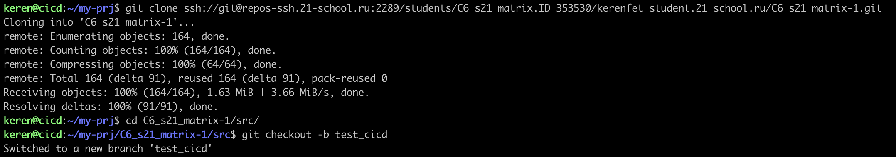
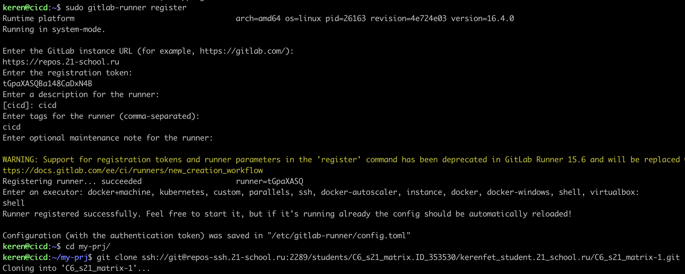
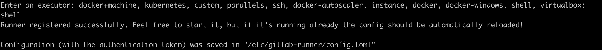
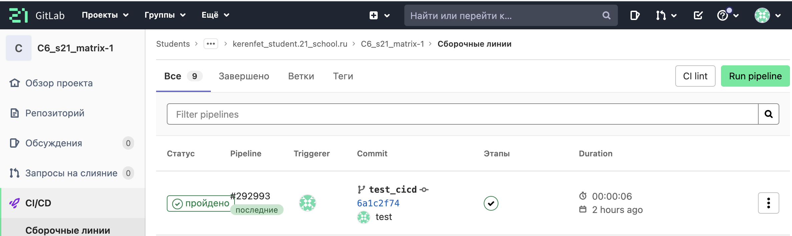
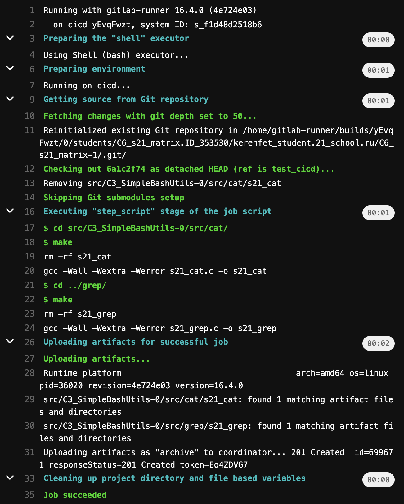
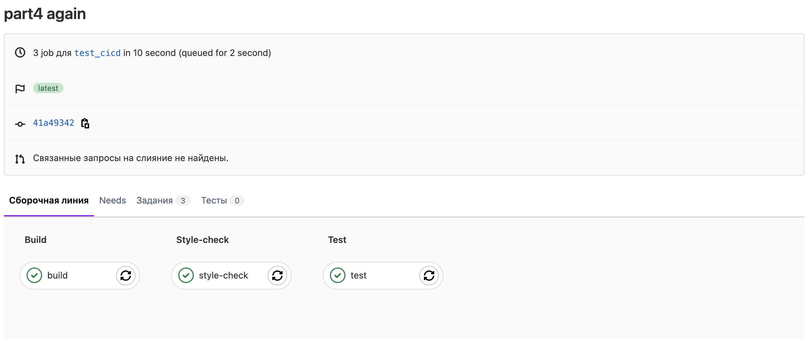
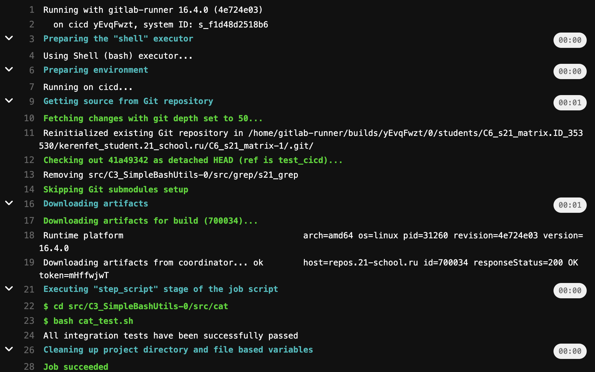

# Часть 1. Настройка gitlab-runner

- Запустите виртуальную машину Ubuntu Server 20.04 LTS

- Загрузите и установите gitlab-runner на виртуальную машину
```
ssh -p 4457 keren@localhost
```
1. Добавьте официальный репозиторий GitLab: 
```
 curl -L "https://packages.gitlab.com/install/repositories/runner/gitlab-runner/script.deb.sh" | sudo bash. 
```


2. Установите последнюю версию GitLab Runner: 

```
sudo apt-get install gitlab-runner
```

Проверить status 

```
sudo systemctl status gitlab-runner 
```

## Регистрация runner для текущего проекта:

1. Запустите команду регистрации: $ sudo gitlab-runner register.



2. Введите URL-адрес вашего экземпляра GitLab: $ https://repos.21-school.ru.

3. Введите токен: токен можно найти в описании задачи проекта на платформе «Школа 21» .


4. Введите описание runner.

5. Введите теги, связанные с runner, через запятую.
лучше пропустить и не вводить или добавить, но пото указать эти данные в файле .gitlab-ci.yml
6. Предоставьте исполнителя runner.



# Часть 2. Строительство

- Напишите этап для CI для сборки приложений из проекта C2_SimpleBashUtils :

1. В файле gitlab-ci.yml добавьте этап для запуска сборки через make-файл из проекта C2 
2. Сохраните файлы после сборки (артефакты) в случайный каталог со сроком хранения 30 дней.

```
build:
  stage: build
  script:
    - cd src/C3_SimpleBashUtils-0/src/cat/
    - make
    - cd ../grep/
    - make
  artifacts:
    paths:
    - src/C3_SimpleBashUtils-0/src/cat/s21_cat
    - src/C3_SimpleBashUtils-0/src/grep/s21_grep
    expire_in: 30 days
```
зайти в ci/cd runner на gitlab



# Часть 3. Тест стиля кода

## Напишите этап для CI , который запускает сценарий стиля кода ( clang-format ):
Если кодовый файл не прошел, «сбой» конвейера.
В конвейере отобразите выходные данные утилиты формата clang.


```
stages:
  - style-check

style-check:
  stage: style-check
  script:
    - clang-format --style=Google -n -Werror src/C3_SimpleBashUtils-0/src/cat/*.h src/C3_SimpleBashUtils-0/src/cat/*.c src/C3_SimpleBashUtils-0/src/grep/*.h src/C3_SimpleBashUtils-0/src/grep/*.c 
```


# Часть 4. Интеграционные тесты
## Напишите этап для CI , который запускает интеграционные тесты из того же проекта:
Запускайте этот этап автоматически только в том случае, если тест сборки и стиля кода пройден успешно.
Если тесты не прошли, провалите конвейер

```
stages:
  - test 

test:
  stage: test
  script:
    - cd src/C3_SimpleBashUtils-0/src/cat
    - bash cat_test.sh
    - cd ../grep/ 
    - bash grep_test.sh
```


В конвейере отображайте результаты успешных/неудачных интеграционных тестов.

# Часть 5. Этап развертывания

Запустите вторую виртуальную машину Ubuntu Server 20.04 LTS.
Напишите сцену для компакт-диска , которая «разворачивает» проект на другой виртуальной машине:

1. Изменяем файл /etc/netplan/00-installer-config.yaml на обеих машинах:


2. Изменяем настройки адаптеров:


3. Пропингуем вторую машину с первой, чтобы убедиться, что соединение есть:


4. 

На первой машине:
4.1 Зайти из-под пользователя gitlab-runner предварительно задав пароль командой 
```
sudo passwd gitlab-runner
```
Командой usermod с флагами -aG добавляем sam_raimi в группу adm. -a указывает, что нужно добавить пользователя к указанной группе, а не заменять его текущие группы, а -G указывает на группы, к которым пользователь должен быть добавлен:
```
sudo usermod -aG sudo username
```
Переходим к пользователю gitlab-runner
```
su gitlab-runner
```

4.2 Сгенерировать ssh ключ командой ssh-keygen и скопируем его на вторую машину командой 
```
ssh-keygen 
ssh-copy-id keren@10.10.0.2
```

Можно проверить перекидываются ли файлы 
```
scp test.txt keren@10.10.0.2:/usr/local/bin/
```


4.3 

На второй машине дадим права для папки /usr/local/bin/ командой sudo chmod -R 777 /usr/local/bin
```
sudo chmod 777 /usr/local/bin/
```
Также на второй машине дадим расширенные права доступа для избежания ошибки (sudo: a terminal is required to read the password; either use the -S option to read from standard input or configure an askpass helper)

```
chmod 600 ~/.ssh/authorized_keys
```

5. Напишите сцену для компакт-диска , которая «разворачивает» проект на другой виртуальной машине:
Запустите этот этап вручную, если все предыдущие этапы прошли успешно.

```
stages:
  - deploy
deploy:
  stage: deploy
  script:
    - cd src/scripts/
    - chmod +x deploy.sh 
    - bash deploy.sh
  when: manual
```

6. Написать bash-скрипт, который копирует полученные после сборки файлы (артефакты) в каталог /usr/local/bin второй виртуальной машины с помощью ssh и scp 

```
#!/bin/bash

cat_path=./../C3_SimpleBashUtils-0/src/cat/s21_cat
grep_path=./../C3_SimpleBashUtils-0/src/grep/s21_grep

scp $cat_path $grep_path keren@10.10.0.2:/usr/local/bin/
ssh keren@10.10.0.2 ls /usr/local/bin/
```

7. Запушить все изменения 
После пуша стадия деплой ждёт ручного запуска:

Деплой прошёл успешно, файлы появились в нужной папке на второй машине:


# Part 6. Дополнительно. Уведомления

Настройте уведомления об успешном/неуспешном выполнении конвейера через бота с именем «[ваш ник] DO6 CI/CD» в Telegram
Текст уведомления должен содержать информацию об успешном прохождении как этапов CI , так и CD .
Остальной текст уведомления может быть произвольным.

1. Напишем @botfather, чтобы создать бота и получить его токен:


Для получения ID @userinfobot в тг:


2. Добавим по вызову скрипта bot.sh после каждой стадии script:

```
  after_script:
    - bash src/scripts/bot.sh "stage name" 
```

3. Содержимое скрипта bot.sh:

```
#!/bin/bash
TELEGRAM_BOT_TOKEN="6645487497:AAERRoVIOUfD6ZxKVBcUWWzrfLnGOxcThuI"
TELEGRAM_USER_ID="814261102"
TIME='10 seconds'
URL="https://api.telegram.org/bot$TELEGRAM_BOT_TOKEN/sendMessage"
if [[ $CI_JOB_STATUS = "success" ]]; then
    STATUS=✅
else
    STATUS=❌
fi
TEXT="Stage '$1'%0AStatus: $STATUS%0A%0AProject:+$CI_PROJECT_NAME%0AURL:+$CI_PROJECT_URL/pipelines/$CI_PIPELINE_ID/%0ABranch:+$CI_COMMIT_REF_SLUG"

curl -s --max-time $TIME -d "chat_id=$TELEGRAM_USER_ID&disable_web_page_preview=1&text=$TEXT" $URL > /dev/null
```

4. Пушим, проверяем работу:
